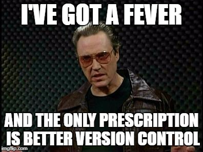

```{r setup, include=FALSE}
knitr::opts_chunk$set(echo = FALSE)
```


## What you will learn

* Git
    - what is Git?
    - installing Git on your machine
    - basic commands
    - setting up a Git repo on a local machine

* GitHub
    - what is GitHub?
    - signing up
    - connecting your local Git repo to GitHub
    - selecting an awesome avatar will not be covered


# 

```{r, out.width = "400px", fig.align = "center"}
knitr::include_graphics("Git.png")
```


## A typical workflow

<div class="columns-2">
* File renaming
* Absurd folder structures
* Zipped folders
* E-mailing files back and forth
* Lost files
* Shared directories (one-at-a-time)
* Ever try merging two MS Word documents with tracked changes?!

```{r, out.width = "300px"}
knitr::include_graphics("before-version-control.png")
```
</div>


## 

<center></center>


##

```{r, out.width = "600px"}

```


## What is Git?

* Think of it as MS Word's "Tracked Changes" on steroids
* Invented by Linus Torvalds (and the Linux development community) in 2005
* Git provides an excellent way to track changes in computer files (e.g., R scripts, LaTeX files, etc.) and coordinating among many users.
* Free book on the Git website: https://git-scm.com/book/en/v2

```{r, out.width = "150px"}
knitr::include_graphics("progit2.png")
```


## Using Git

There are a lot of different ways to use Git, for example, the **command line**, one of several desktop applications, and even within RStudio.

* I recommend the command line for three reasons: **(1)** it's simpler (trust me), **(2)** it's (probably) faster, and **(3)** it works the same on Windows, Mac, and Linux
* You'll need to know how to open the Terminal in Mac or Command Prompt or Powershell in Windows
* Using it via RStudio is convenient, especially if you're building R packages, etc.
* The desktop application is convenient too, but not available on all operating systems


## Installing Git

Installation is rather straightforward: https://git-scm.com/downloads. Just follow the instructions for your particular operating system

**Tip\:** Windows users, you should install from here: https://git-for-windows.github.io/

## Setting Git up for the first time

After Git is successfully installed, open up a terminal and write (with the obvious modifications) the following two lines:
```shell
$ git config --global user.name "Brandon Greenwell"
$ git config --global user.email greenwell.brandon@gmail.com
```
**Note:** Since you passed the option `--global`, you only need to do this once!

**Note:** Technically, you don't need to do this step, but you should!

**Note:** Windows users should use the Bash terminal that was installed with Git, not the normal Windows command line!


## The basic commands you'll use/need
- `cd` (change directories)
- `git init` (initialize a folder as a Git repo)
- `git add <file-name>` (start tracking a new file)
- `git commit -m "fix typo"` (commit your changes)
- `git clone` (clone/copy another Git repo [e.g., from GitHub])
- `git push origin master` (push your master branch to your origin server)
- `git pull origin master` (update your local repo)

**Tip\:** Typing `git add --all` will start tracking everything (this is how I almost always use `git add`).


## Initializing a repo in an existing directory

Make a new folder called `arithmetic` anywhere on your computer (e.g., the Desktop) that contains a single R script called `add.R` containing the function
```r
add <- function(x, y) {
  x * y
}
```


## Initializing a repo in an existing directory

If you want to begin tracking an existing project in Git, you need to start by going to the project's root directory. For example, 
```shell
cd C:/Users/greenweb/Desktop/arithmetic
```
takes me to the folder called `arithmetic` on my Desktop. Then, to initialize this as a Git repo, just type
```shell
git init
```


**Tip\:** the command line has a history (just like the R console), so you don't need to type as often; just hit the up arrow and make any necessary changes!


## Initializing a repo in an existing directory

If you want to start version controlling all the files, you need to start tracking them. In the terminal, type the following:
```shell
git add --all
```
then type:
```shell
git commit -m "first commit"
```


# GitHub

```{r, out.width = "600px"}
knitr::include_graphics("Octocat.png")
```


## What is GitHub?

- GitHub is a web-based Git repo and Internet hosting service
- It is the single largest host for Git repos
- Quite popular for code collaboration (no more emails and zip files!!)
- Mostly used for code
- The development versions of a lot of R packages are hosted on GitHub: https://github.com/tidyverse/ggplot2
- All the [cool people](https://github.com/bgreenwell) are using it!


## Account setup and configuration

The first thing you need to do is set up an account: https://github.com/

```{r, out.width = "400px"}
knitr::include_graphics("signup.png")
```

Then go check your e-mail to verify the e-mail address you provided.


## Set up your profile

```{r, out.width = "800px"}
knitr::include_graphics("my-profile.png")
```


## Creating a new repo

```{r, out.width = "600px"}
knitr::include_graphics("new-repo.png")
```


## Creating a new repo

```{r, out.width = "600px"}
knitr::include_graphics("new-repo-2.png")
```


## Creating a new repo

```{r, out.width = "700px"}
knitr::include_graphics("new-repo-3.png")
```


## Creating a new repo

```{r, out.width = "700px"}
knitr::include_graphics("new-repo-4.png")
```


## Creating a new repo

Refresh your browswer and see if it worked!

```{r, out.width = "700px"}
knitr::include_graphics("new-repo-5.png")
```


## Making changes and pushing them to GitHub

Fix the obvious typo in `add.R`. Then, take a snapshot (i.e., `git add/commit`) and push the changes to GitHub (i.e., `git push`)!
```shell
git add --all
git commit -m "fix typo"
git push origin master
```
Refresh your browser to see the changes.

**Tip\:** It's good practice to do this every time you make a key change (e.g., fix a typo, add a new function to an R script, etc.).

\* Make sure you're in the right directory!


## All done!

<center></center>

**Any questions?**
