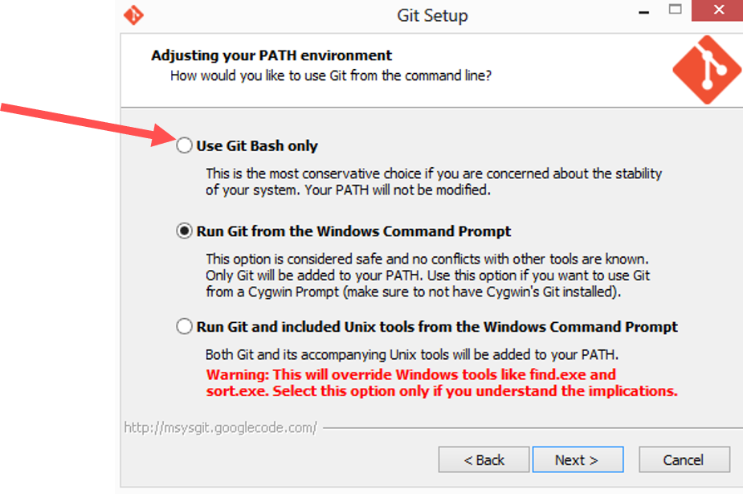
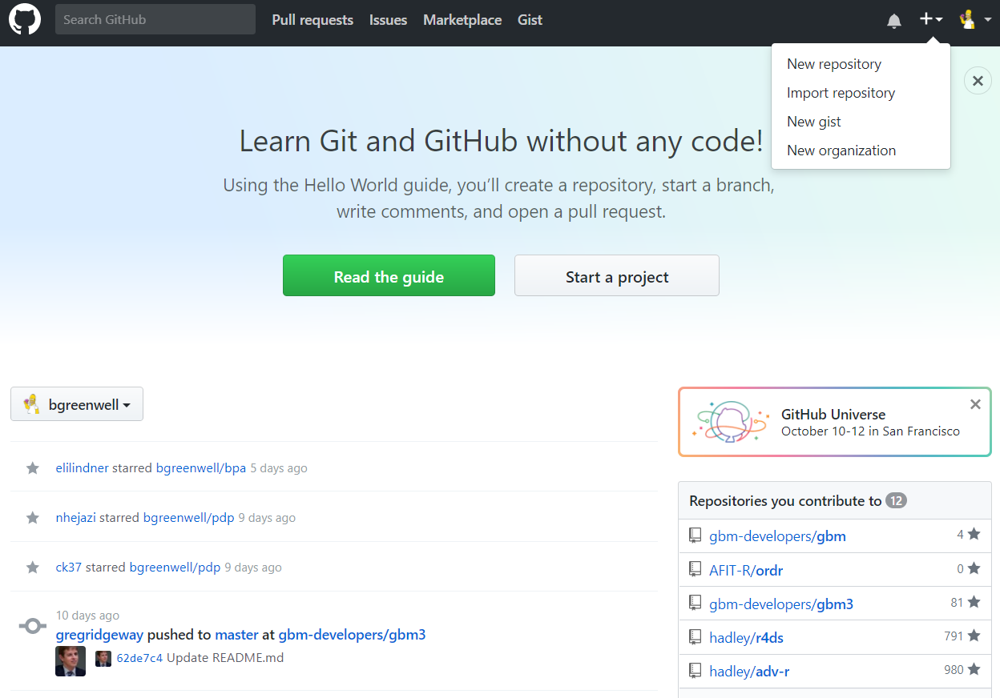

# Overview

```{r setup, echo=FALSE}
knitr::opts_chunk$set(echo = FALSE)
shiny::includeCSS("css/flatly-style.css")
shiny::includeScript("js/jquery.min.js")
shiny::includeScript("js/jkf-scroll.js")
```

## This presentation covers the following concepts

- Getting started with Git and Github

- The basics of version control systems

- Using Git and Github for collaborative software development

# Getting Started with Git & Github

## What is Git?

- A <u>decentralized</u> version control system that's free and open source

- An excellent way to track and coordinate file changes among many people

- A filing system for every draft of a document

- A tool invented by Linus Torvalds (and the Linux development community) to develop the Linux kernel in 2005

- The most widely used modern version control system in the world -- <focus>by far</focus>

- Free software distributed under the terms of the [GNU General Public License](https://en.wikipedia.org/wiki/GNU_General_Public_License) version 2

- While mainly used for code, Git can be used to manage any type of file/project 
  
    + Word documents
    
    + Final Cut projects
    
    + The entire volume of [German federal laws](https://github.com/bundestag/gesetze)

## What is GitHub?

- A code sharing and publishing service

- A social networking site for programmers

- The single largest web-based service for hosting Git repositories

- A popular way to collaborate on code (no more emails and zip files!!)

    + The development versions of many R packages are hosted on GitHub: https://github.com/tidyverse/ggplot2
    
    + All the [cool kids](https://github.com/auburngrads) are using it!

- Includes several features beyond command-line Git

    + A Web-based graphical interface
    
    + Task/project management tools
    
    + A [martketplace](https://github.com/marketplace) of integrations for many 3^rd^ party services
    
    + Issues!
    
    + Forking!

# Why Should You use Git and GitHub?

## For a fast, easy, and stress-free workflow


<ul style="display:inherit;">
- Workflows without Git typically consist of

    * Lots of File renaming
    * Absurd folder structures
    * Zipped folders
    * E-mailing files back and forth
    * Lost files
    * Shared directories (one-at-a-time)
    * Ever try merging MS Word files with tracked changes?!
</ul>

<div id="container2">
<div id="container1">

<div id="col1">
<center>
Your workflow - <font color='red'><u>without</u></font> Git
<br/>
<br/>

</center>
</div>

<div id="col2">
<center>
Your workflow - <font color='green'><u>with</u></font> Git
<br/>
<br/>

</center>
</div>
</div>
</div>

# OK, I'm interested in using Git/Github how do I get Started?

## Installing Git <!--Kallhoff-->

## Installing Git (Mac/linux/unix)

- For Mac, Linux, and Unix users

    + Download Git from https://git-scm.com/downloads. 
    + Accept the installation defaults for your particular operating system

## Installing Git (windows)

- For Windows users

    + Download Git from https://git-scm.com/downloads. 
    + Accept the installation defaults __EXCEPT__ Choose Use Git Bash



## Setting Git up for the first time

- After Git has installed

    + You need modify the global configuration file to tell Git who you are.
    + Open a terminal or Git Bash (Windows) and enter the following two lines: (with the obvious modifications) 
    
```{sh, eval=!TRUE}
git config --global user.name "Auburngrads"
git config --global user.email auburngrads@live.com
```

- Since you passed the option `--global`, you only need to do this once!

## Configuring Git <!--Munson-->

## Setting up a GitHub account <!--Stuntz-->


# Version Control Systems

## The Basics of Version Control Systems

- Before getting too deep into Git, let's take a step back 

- Git is one of many different version control systems (VCS)

- It's important to understand what a VCS is and the different types of VCS that exist

## What are version control systems? <!--Butt-->

## Why should some use a version control system? <!--Elliot-->

## What is a Centralized Version Control System (CVCS)? <!--Gallagher-->

## What is a Decentralized (aka Distributed) Version Control System (DVCS)? <!--Johnson-->

## What are the advantages of using a DVCS instead of a CVCS? <!--Uhorchak-->


# Using Git

## Is Git hard to learn?

- New users often struggle with understanding how to use Git

- This misunderstanding is driven by the fact that there seems to be an endless number of use cases

- Git's not hard to learn -   
    + There are problem 

<!--## 
    + what is Git?
    + Installing Git on your machine
    + basic commands
    + setting up a Git repo on a local machine

- GitHub

    - what is GitHub?
    - signing up
    - connecting your local Git repo to GitHub
    - selecting an awesome avatar will not be covered

# Git
-->


# Using Git

## Methods of Using Git

- There several Methods for using Git 

    - At the **command line**
    - Within an IDE (e.g. RStudio)
    - From one of several [Git desktop GUI](https://git-scm.com/downloads/guis)
    - <p class='hover'>Super secret hybrid method</p>

## Which method should you choose?

- At the **command line**

    + Simplest (really!) & fastest
    + Works the same on Windows, Mac, and Linux
    
- Within an IDE (e.g. RStudio)

    + Convenient when building R packages
    + Can be clunky to update many files
    
- From a Git [desktop GUI](https://git-scm.com/downloads/guis)

## Installing Git


## The basic process

- Initialize Git version tracking in a directory
- Add or edit files in the directory
- Check the status of file changes in the directory
- Add changed files to the staging area
- Commit one or changed files to be updated
- Push commits to the master

## The basic commands you'll use/need

- `cd` (change directories)
- `git init` (initialize a folder as a Git repo)
- `git add <file-name>` (start tracking a new file)
- `git commit -m "fix typo"` (commit your changes)
- `git clone` (clone/copy another Git repo [e.g., from GitHub])
- `git push origin master` (push your master branch to your origin server)
- `git pull origin master` (update your local repo)
**Tip\:** Typing `git add --all` will start tracking everything (this is how I almost always use `git add`).

## Using Git commands

- Initialize a repo in an existing directory

    + Create a new folder called `arithmetic` anywhere on your computer (e.g., the Desktop) 
    + In this folder, create a new R script file called `add.R` 
    + In this new file add the following code
    
```{r, echo=TRUE}
add <- function(x, y) { x * y }
```

## Initializing a repo in an existing directory

- Next, open a terminal or Git Bash (Windows) and go to the project's root directory

- For example, the code below takes me to the folder called `arithmetic` on my Desktop

```{sh, echo=TRUE, eval=F}
cd C:/Users/greenweb/Desktop/arithmetic
```

- Then, to initialize this as a Git repo, just type
```{sh, echo=T, eval=F}
git init
```

**Tip\:** the command line has a history (just like the R console), so you don't need to type as often; just hit the up arrow and make any necessary changes!


## Initializing a repo in an existing directory

If you want to start version controlling all the files, you need to start tracking them. In the terminal, type the following:

```{sh, eval=F}
git add --all
```

then type:

```{sh, eval=F}
git commit -m "first commit"
```

## How to use Git

* Free book on the Git website: https://git-scm.com/book/en/v2

```{r, out.width = "150px"}
knitr::include_graphics("progit2.png")
```


# GitHub

```{r, out.width = "600px"}
knitr::include_graphics("Octocat.png")
```

## Account setup and configuration

The first thing you need to do is set up an account: https://github.com/

```{r, out.width = "400px"}
knitr::include_graphics("signup.png")
```

**Use the same e-mail address you used when setting up Git!**


## Set up your profile

```{r, out.width = "700px"}
knitr::include_graphics("my-profile.png")
```


## Creating a new repo

```{r, out.width = "600px"}

```


## Creating a new repo

```{r, out.width = "600px"}
knitr::include_graphics("new-repo-2.png")
```


## Creating a new repo

```{r, out.width = "700px"}
knitr::include_graphics("new-repo-3.png")
```


## Creating a new repo

```{r, out.width = "700px"}
knitr::include_graphics("new-repo-4.png")
```


## Creating a new repo

Refresh your browswer and see if it worked!

```{r, out.width = "700px"}
knitr::include_graphics("new-repo-5.png")
```


## Making changes and pushing them to GitHub

Fix the obvious typo in `add.R`. Then, take a snapshot (i.e., `git add/commit`) and push the changes to GitHub (i.e., `git push`)!

```{sh, eval=F}
git add --all
git commit -m "fix typo"
git push origin master
```

Refresh your browser to see the changes.

**Tip\:** It's good practice to do this every time you make a key change (e.g., fix a typo, add a new function to an R script, etc.).

\* Make sure you're in the right directory!


## All done!

<center></center>

**Any questions?**
